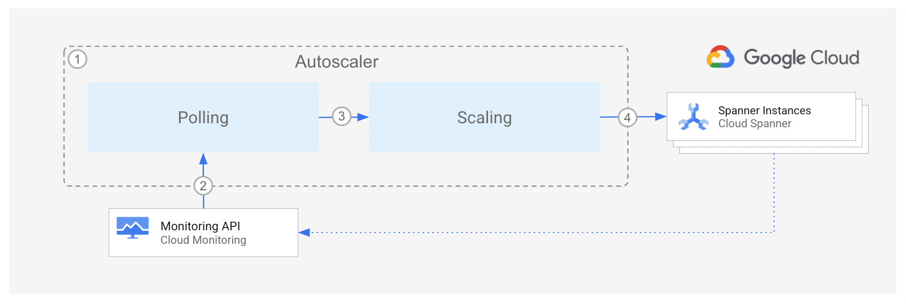

<br />
<p align="center">
  <h2 align="center">Autoscaler tool for Cloud Spanner</h2>
  

  <p align="center">
    An open source tool to autoscale Spanner instances
    <br />
    Home
    ·
    <a href="src/poller/README.md">Poller component</a>
    ·
    <a href="src/scaler/README.md">Scaler component</a>
    ·
    <a href="src/forwarder/README.md">Forwarder component</a>
    ·
    <a href="terraform/README.md">Terraform configuration</a>
    ·
    <a href="terraform/README.md#Monitoring">Monitoring</a>
  </p>
</p>

## Table of Contents

*   [Table of Contents](#table-of-contents)
*   [Overview](#overview)
*   [Architecture](#architecture)
*   [Deployment](#deployment)
*   [Configuration](#configuration)
*   [Licensing](#licensing)
*   [Contributing](#contributing)

## Overview

The Autoscaler tool for Cloud Spanner is a companion tool to Cloud Spanner
that allows you to automatically increase or reduce the number of nodes or
processing units in one or more Spanner instances, based on their utilization.

When you create a [Cloud Spanner instance][spanner-instance], you choose the
number of [nodes or processing units][compute-capacity] that provide compute
resources for the instance. As the instance's workload changes, Cloud Spanner
does *not* automatically adjust the number of nodes or processing units in the
instance.

The Autoscaler monitors your instances and automatically adds or
removes compute capacity to ensure that they stay within the
[recommended maximums for CPU utilization][spanner-max-cpu] and the
[recommended limit for storage per node][spanner-max-storage], plus or
minus an [allowed margin](src/poller/README.md#margins). Note that the
recommended thresholds are different depending if a Spanner instance is
[regional or multi-region][spanner-regional].

## Architecture



The diagram above shows the high level components of the Autoscaler and the
interaction flow:

1.  The Autoscaler consists of two main decoupled components:
    *   [The Poller component][autoscaler-poller]
    *   [The Scaler component][autoscaler-scaler]

    These can be deployed to either [Cloud Functions][cloud-functions] or
    [Google Kubernetes Engine (GKE)][gke], and configured so that the
    Autoscaler runs according to a user-defined schedule. In certain deployment
    topologies a third component, the [Forwarder][autoscaler-forwarder], is also
    deployed.

2.  At the specified time and frequency, the Poller component queries the
    [Cloud Monitoring][cloud-monitoring] API to retrieve the utilization metrics
    for each Spanner instance.

3.  For each instance, the Poller component pushes one message to the Scaler
    component. The payload contains the utilization metrics for the
    specific Spanner instance, and some of its corresponding configuration
    parameters.

4.  Using the chosen [scaling method](src/scaler/README.md#scaling-methods),
    the Scaler compares the Spanner instance metrics against the recommended
    thresholds, (plus or minus an [allowed margin](src/poller/README.md#margins)),
    and determines if the instance should be scaled, and the number of nodes or
    processing units that it should be scaled to. If the configured cooldown
    period has passed, then the Scaler component requests the Spanner Instance
    to scale out or in.

Throughout the flow, the Autoscaler writes a step by step summary
of its recommendations and actions to [Cloud Logging][cloud-logging] for
tracking and auditing.

## Deployment

To deploy the Autoscaler, decide which of the following strategies
is best adjusted to fulfill your technical and operational needs:

*   [Deployment to Cloud Functions](terraform/cloud-functions/README.md)
*   [Deployment to Google Kubernetes Engine (GKE)](terraform/gke/README.md)

In both of the above instances, the Google Cloud Platform resources are
deployed using Terraform. Please see the [Terraform instructions](terraform/README.md)
for more information on the deployment options available.

## Monitoring

The autoscaler publishes the following metrics to Cloud Monitoring which can be
used to monitor the behavior of the autoscaler, and to configure alerts.

### Poller

*   Message processing counters:
    *   `cloudspannerecosystem/autoscaler/poller/requests-success` - the number
        of polling request messages recieved and processed successfully.
    *   `cloudspannerecosystem/autoscaler/poller/requests-failed` - the number
        of polling request messages which failed processing.

*   Spanner Instance polling counters:
    *   `cloudspannerecosystem/autoscaler/poller/polling-success` - the number
        of successful polls of the Spanner instance metrics.
    *   `cloudspannerecosystem/autoscaler/poller/polling-failed` - the number of
        failed polls of the Spanner instance metrics.
    *   Both of these metrics have `projectid` and `instanceid` to identify the
        Spanner instance.

### Scaler

*   Message processing counters:
    *   `cloudspannerecosystem/autoscaler/scaler/requests-success` - the number
        of scaling request messages recieved and processed successfully.
    *   `cloudspannerecosystem/autoscaler/scaler/requests-failed` - the number
        of scaling request messages which failed processing.
*   Spanner Instance scaling counters:
    *   `cloudspannerecosystem/autoscaler/scaler/scaling-success` - the number
        of succesful rescales of the Spanner instance.
    *   `cloudspannerecosystem/autoscaler/scaler/scaling-denied` - the number of
        Spanner instance rescale attempts that failed
    *   `cloudspannerecosystem/autoscaler/scaler/scaling-failed` - the number of
        Spanner instance rescale attempts that were denied by autoscaler
        configuration or policy.

    *   These three metrics have the following attributes:
        *   `spanner_project_id` - the Project ID of the affected Spanner
            instance
        *   `spanner_instance_id` - the Instance ID of the affected Spanner
            instance
        *   `scaling_method` - the scaling method used
        *   `scaling_direction` - which can be `SCALE_UP`, `SCALE_DOWN` or
            `SCALE_SAME` (when the calculated rescale size is equal to the
            current size)
        *   In addition, the `scaling-denied` counter has a `scaling_denied_reason`
            attribute containing the reason why the scaling was not performed, which
            can be:
            *   `SAME_SIZE` - when the calculated rescale size is equal to the
                current instance size.
            *   `MAX_SIZE` - when the instance has already been scaled up to the
                maximum configured size.
            *   `WITHIN_COOLDOWN` - when the instance has been recently rescaled,
                and the autoscaler is waiting for the cooldown period to end.
            *   `IN_PROGRESS` - when an instance scaling operation is still
                ongoing.

## Configuration

The parameters for configuring the Autoscaler are identical regardless of the chosen
deployment type, but the mechanism for configuration differs slightly:

*   [Cloud Functions](terraform/cloud-functions/README.md#configuration)
*   [Google Kubernetes Engine (GKE)](terraform/gke/README.md#building-and-deploying-the-autoscaler-services)

There is also a [browser-based configuration file editor and a command line
configuration file validator][configeditor].

## Licensing

```lang-none
Copyright 2020 Google LLC

Licensed under the Apache License, Version 2.0 (the "License");
you may not use this file except in compliance with the License.
You may obtain a copy of the License at

    https://www.apache.org/licenses/LICENSE-2.0

Unless required by applicable law or agreed to in writing, software
distributed under the License is distributed on an "AS IS" BASIS,
WITHOUT WARRANTIES OR CONDITIONS OF ANY KIND, either express or implied.
See the License for the specific language governing permissions and
limitations under the License.
```

## Getting Support

The Autoscaler is a [Cloud Spanner Ecosystem](https://www.cloudspannerecosystem.dev/about)
project based on open source contributions. We'd love for you to
[report issues, file feature requests][new-issue], and [send pull requests][new-pr]
(see [Contributing](README.md#contributing)). You may file bugs and feature
requests using GitHub's issue tracker or using the existing Cloud Spanner
support channels.

## Contributing

*   [Contributing guidelines][contributing-guidelines]
*   [Code of conduct][code-of-conduct]

<!-- LINKS: https://www.markdownguide.org/basic-syntax/#reference-style-links -->

[autoscaler-poller]: src/poller/README.md
[autoscaler-scaler]: src/scaler/README.md
[autoscaler-forwarder]: src/forwarder/README.md
[cloud-functions]: https://cloud.google.com/functions
[cloud-monitoring]: https://cloud.google.com/monitoring
[cloud-logging]: https://cloud.google.com/logging
[compute-capacity]: https://cloud.google.com/spanner/docs/compute-capacity#compute_capacity
[code-of-conduct]: code-of-conduct.md
[configeditor]: configeditor/README.md
[contributing-guidelines]: contributing.md
[gke]: https://cloud.google.com/kubernetes-engine
[new-issue]: https://github.com/cloudspannerecosystem/autoscaler/issues/new
[new-pr]: https://github.com/cloudspannerecosystem/autoscaler/compare
[spanner-instance]: https://cloud.google.com/spanner/docs/instances
[spanner-max-cpu]: https://cloud.google.com/spanner/docs/cpu-utilization#recommended-max
[spanner-max-storage]: https://cloud.google.com/spanner/docs/monitoring-cloud#storage
[spanner-regional]: https://cloud.google.com/spanner/docs/instances#configuration
