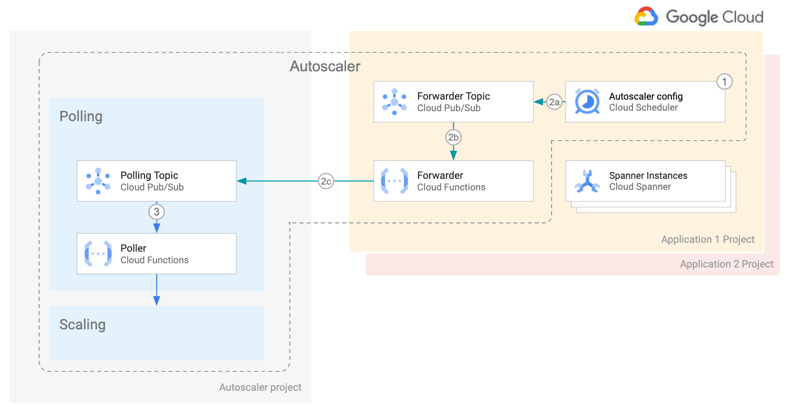

 

  <h2 align="center">Cloud Spanner Autoscaler</h2>
  

  

    <!-- In one sentence: what does the code in this directory do? -->
    Forward messages from Cloud Scheduler to the Poller function topic.
     
    <a href="../README.md">Home</a>
    ·
    <a href="../forwarder/README.md">Poller function</a>
    ·
    <a href="../scaler/README.md">Scaler function</a>
    ·
    Forwarder function
    ·
    <a href="../terraform/README.md">Terraform configuration</a>
  

## Table of Contents

- [Table of Contents](#table-of-contents)
- [Overview](#overview)
- [Architecture](#architecture)
- [Configuration parameters](#configuration-parameters)
  - [Required](#required)

## Overview

The Forwarder function takes messages published to PubSub from Cloud Scheduler, checks their JSON syntax and forwards them to the Poller PubSub topic. The topic can belong to a different project that the Scheduler. 

This function is needed only in the [distributed deployment](../terraform/distributed/README.md) because Cloud Scheduler can only publish to topics in the same project as the Scheduler.

## Architecture

The Cloud Spanner instances reside in a given application project.

<ul> <li style="list-style-type: none;">
  1 . Cloud Scheduler lives in the same project as the Cloud Spanner instances.

  2a. Cloud Scheduler publishes its messages to the Forwarder topic in the same project.

  2b. The Forwarder Cloud Function reads messages from the Forwarder topic, and

  2c. Forwards them to the Polling topic. The Polling topic resides in a different project.

  3 . The Poller function reads the messages from the polling topic and urther continues the process as described in the [main architecture section](../README.md#architecture).
</li> </ul> 

It is important to note that Autoscaler infrastructure is now distributed across several projects.
* The core components reside in the Autoscaler project
* An instance of Cloud Scheduler, the Forwarder topic and the Forwarder Function reside in each of the application projects.

## Configuration parameters
 
Using the Forward function forwards to the PubSub specified in the environment variable `POLLER_TOPIC`.

### Required
| Key                 | Description                                                        |
|---------------------|--------------------------------------------------------------------|
| `POLLER_TOPIC`      | PubSub topic the Poller function listens on  |

<!-- LINKS: https://www.markdownguide.org/basic-syntax/#reference-style-links -->
[cloud-monitoring]: https://cloud.google.com/monitoring
[spanner-metrics]: https://cloud.google.com/spanner/docs/monitoring-cloud#create-alert
[autoscaler-home-config]: ../README.md#configuration
[autoscaler-scaler-methods]: ../scaler/README.md#scaling-methods
[cloud-firestore]: https://cloud.google.com/firestore
[spanner-regional]: https://cloud.google.com/spanner/docs/instances#configuration