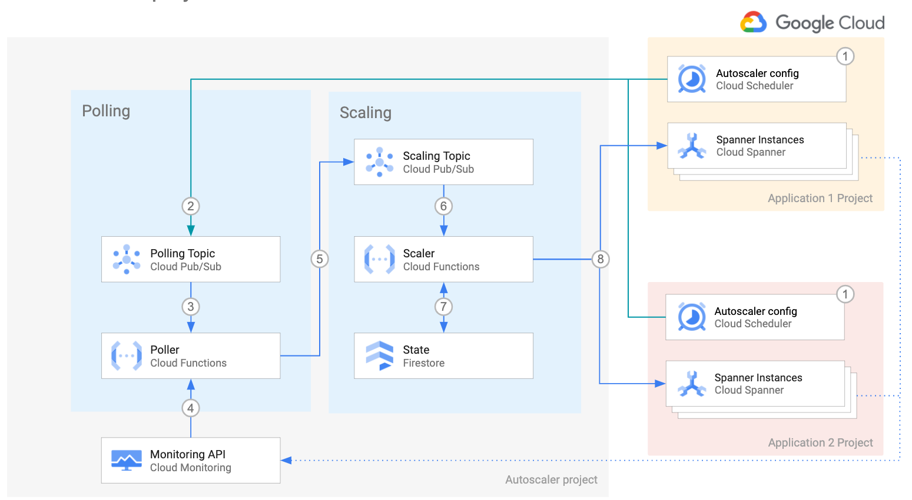

<br />
<p align="center">
  <h2 align="center">Autoscaler tool for Cloud Spanner</h2>
  

  <p align="center">
    <!-- In one sentence: what does the code in this directory do? -->
    Set up the Autoscaler in Cloud Functions in a distributed deployment using Terraform
    <br />
    <a href="../../../README.md">Home</a>
    ·
    <a href="../../../scaler/README.md">Scaler component</a>
    ·
    <a href="../../../poller/README.md">Poller component</a>
    ·
    <a href="../../../forwarder/README.md">Forwarder component</a>
    ·
    Terraform configuration
    ·
    Monitoring
    <br />
    Cloud Functions
    ·
    <a href="../../gke/README.md">Google Kubernetes Engine</a>
    <br />
    <a href="../per-project/README.md">Per-Project</a>
    ·
    <a href="../centralized/README.md">Centralized></a>
    ·
    Distributed

  </p>

</p>

## Table of Contents

*   [Table of Contents](#table-of-contents)
*   [Overview](#overview)
*   [Architecture](#architecture)
    *   [Pros](#pros)
    *   [Cons](#cons)
*   [Before you begin](#before-you-begin)
*   [Preparing the Autoscaler Project](#preparing-the-autoscaler-project)
    *   [Deploying the Autoscaler](#deploying-the-autoscaler)
*   [Preparing the Application Project](#preparing-the-application-project)
    *   [Deploying the Autoscaler](#deploying-the-autoscaler)
    *   [Authorize the Forwarder function to publish to the Poller topic](#authorize-the-forwarder-function-to-publish-to-the-poller-topic)
*   [Verifying your deployment](#verifying-your-deployment)

## Overview

This directory contains Terraform configuration files to quickly set up the
infrastructure for your Autoscaler with a distributed deployment.

In this deployment option all the components of the Autoscaler
reside in a single project, with the exception of Cloud Scheduler (step 1) and
the [Forwarder topic and function](../../../forwarder/README.md)

This deployment is the best of both worlds between the per-project and the
centralized deployments: *Teams who own the Spanner instances, called
Application teams, are able to manage the Autoscaler configuration parameters
for their instances with their own Cloud Scheduler jobs.* On the other hand,
the rest of the Autoscaler infrastructure is managed by a central team.

## Architecture



For an explanation of the components of the Autoscaler and the
interaction flow, please read the
[main Architecture section](../README.md#architecture).

Cloud Scheduler can only publish messages to topics in the same project.
Therefore in step 2, we transparently introduce an intermediate component to
make this architecture possible. For more information, see the
[Forwarder function](../../../forwarder/README.md).

The distributed deployment has the following pros and cons:

### Pros

*   **Configuration and infrastructure**: application teams are in control of
    their config and schedules
*   **Maintenance**: Scaler infrastructure is centralized, reducing up-keep
    overhead
*   **Policies and audit**: Best practices across teams might be easier to
    specify and enact. Audits might be easier to execute.

### Cons

*   **Configuration**: application teams need to provide service accounts to
    write to the polling topic.
*   **Risk**: the centralized team itself may become a single point of failure
    even if the infrastructure is designed with high availability in mind.

## Before you begin

1.  Open the [Cloud Console][cloud-console]
2.  Activate [Cloud Shell][cloud-shell] \
    At the bottom of the Cloud Console, a
    <a href='https://cloud.google.com/shell/docs/features'>Cloud Shell</a>
    session starts and displays a command-line prompt. Cloud Shell is a shell
    environment with the Cloud SDK already installed, including the
    <code>gcloud</code> command-line tool, and with values already set for your
    current project. It can take a few seconds for the session to initialize.

3.  In Cloud Shell, clone this repository

    ```sh
    git clone https://github.com/cloudspannerecosystem/autoscaler.git
    ```

4.  Export variables for the working directories

    ```sh
    export AUTOSCALER_DIR="$(pwd)/autoscaler/terraform/cloud-functions/distributed/autoscaler-project"
    export APP_DIR="$(pwd)/autoscaler/terraform/cloud-functions/distributed/app-project"
    ```

## Preparing the Autoscaler Project

In this section you prepare the deployment of the project where the centralized
Autoscaler infrastructure, with the exception of Cloud Scheduler, lives.

1.  Go to the [project selector page][project-selector] in the Cloud Console.
    Select or create a Cloud project.

2.  Make sure that billing is enabled for your Google Cloud project.
    [Learn how to confirm billing is enabled for your project][enable-billing].

3.  In Cloud Shell, set environment variables with the ID of your **autoscaler**
    project:

    ```sh
    export AUTOSCALER_PROJECT_ID=<INSERT_YOUR_PROJECT_ID>
    gcloud config set project "${AUTOSCALER_PROJECT_ID}"
    ```

4.  Choose the [region and zone][region-and-zone] and
    [App Engine Location][app-engine-location] where the Autoscaler
    infrastructure will be located.

    ```sh
    export AUTOSCALER_REGION=us-central1
    export AUTOSCALER_ZONE=us-central1-c
    export AUTOSCALER_APP_ENGINE_LOCATION=us-central
    ```

5.  Enable the required Cloud APIs :

    ```sh
    gcloud services enable iam.googleapis.com \
        cloudresourcemanager.googleapis.com \
        spanner.googleapis.com \
        appengine.googleapis.com \
        firestore.googleapis.com \
        pubsub.googleapis.com \
        cloudfunctions.googleapis.com  \
        cloudbuild.googleapis.com \
        cloudresourcemanager.googleapis.com
    ```

6.  Create a Google App Engine app, to enable the APIs for Cloud Scheduler and Firestore.

    ```sh
    gcloud app create --region="${AUTOSCALER_APP_ENGINE_LOCATION}"
    ```

7.  Create database to store the state of the Autoscaler.
     State can be stored in either Firestore or Cloud Spanner.

     In case you want to use Firestore, create a new instance
     if your project does not have yet.

     ```sh
     gcloud firestore databases create --region="${AUTOSCALER_APP_ENGINE_LOCATION}"
     ```

     In case you want to use Cloud Spanner, skip this step
     and perform step 4 in [Deploying the Autoscaler](#deploying-the-autoscaler).

### Deploying the Autoscaler

1.  Set the project ID, region, zone and App Engine location in the
    corresponding Terraform environment variables

    ```sh
    export TF_VAR_project_id="${AUTOSCALER_PROJECT_ID}"
    export TF_VAR_region="${AUTOSCALER_REGION}"
    export TF_VAR_zone="${AUTOSCALER_ZONE}"
    export TF_VAR_location="${AUTOSCALER_APP_ENGINE_LOCATION}"
    ```

2.  Change directory into the Terraform scaler-project directory and initialize
    it.

    ```sh
    cd "${AUTOSCALER_DIR}"
    terraform init
    ```

3.  Create the Autoscaler infrastructure. Answer `yes` when prompted, after
    reviewing the resources that Terraform intends to create.

    ```sh
    terraform apply -parallelism=2
    ```

If you are running this command in Cloud Shell and encounter errors of the form
"`Error: cannot assign requested address`", this is a
[known issue][provider-issue] in the Terraform Google provider, please retry
with -parallelism=1:

## Preparing the Application Project

In this section you prepare the deployment of the Cloud Scheduler, Forwarder
topic and function in the project where the Spanner instances live.

1.  Go to the [project selector page][project-selector] in the Cloud Console.
    Select or create a Cloud project.

2.  Make sure that billing is enabled for your Google Cloud project.
    [Learn how to confirm billing is enabled for your project][enable-billing].

3.  In Cloud Shell, set the environment variables with the ID of your
    **application** project:

    ```sh
    export APP_PROJECT_ID=<INSERT_YOUR_APP_PROJECT_ID>
    gcloud config set project "${APP_PROJECT_ID}"
    ```

4.  Choose the [region and zone][region-and-zone] and
    [App Engine Location][app-engine-location] where the Application project
    will be located.

    ```sh
    export APP_REGION=us-central1
    export APP_ZONE=us-central1-c
    export APP_APP_ENGINE_LOCATION=us-central
    ```

5.  Use the following command to enable the Cloud APIs:

    ```sh
    gcloud services enable iam.googleapis.com \
        cloudresourcemanager.googleapis.com \
        appengine.googleapis.com \
        spanner.googleapis.com \
        pubsub.googleapis.com \
        cloudfunctions.googleapis.com \
        cloudscheduler.googleapis.com \
        cloudbuild.googleapis.com
    ```

6.  Create an App to enable Cloud Scheduler, but do not create a Firestore
    database:

    ```sh
    gcloud app create --region="${APP_APP_ENGINE_LOCATION}"
    ```

### Deploy the Application infrastructure

1.  Set the project ID, region, zone and App Engine location in the
    corresponding Terraform environment variables

    ```sh
    export TF_VAR_project_id="${APP_PROJECT_ID}"
    export TF_VAR_region="${APP_REGION}"
    export TF_VAR_zone="${APP_ZONE}"
    export TF_VAR_location="${APP_APP_ENGINE_LOCATION}"
    ```

2.  Set the project ID where the Autoscaler state will be stored. The Autoscaler
    state includes the timestamps when the scaling events were triggered for
    each instance.

    ```sh
    export TF_VAR_state_project_id="${AUTOSCALER_PROJECT_ID}"
    ```

3.  If you want to create a new Spanner instance for testing the Autoscaler, set
    the following variable. The spanner instance that Terraform creates is named
    `autoscale-test`.

    ```sh
    export TF_VAR_terraform_spanner_test=true
    ```

    On the other hand, if you do not want to create a new Spanner instance
    because you already have an instance for the Autoscaler to monitor, set the
    name name of your instance in the following variable

    ```sh
    export TF_VAR_spanner_name=<INSERT_YOUR_SPANNER_INSTANCE_NAME>
    ```

    For more information on how to make your Spanner instance to be managed by
    Terraform, see [Importing your Spanner instances](#importing-your-spanner-instances)

4.  If you want to use the new Spanner instance for the Autoscaler state
    database, set the following variable:

    ```sh
    export TF_VAR_terraform_spanner_state=true
    ```

    If you want to manage the state of the Autoscaler in your own Cloud Spanner instance,
    please create the following table in advance.

    ```sql
    CREATE TABLE spannerAutoscaler (
       id STRING(MAX),
       lastScalingTimestamp TIMESTAMP,
       createdOn TIMESTAMP,
       updatedOn TIMESTAMP,
    ) PRIMARY KEY (id)
    ```

5.  Change directory into the Terraform app-project directory and initialize it.

    ```sh
    cd "${APP_DIR}"
    terraform init
    ```

6.  Create the infrastructure in the application project. Answer `yes` when
    prompted, after reviewing the resources that Terraform intends to create.

    ```sh
    terraform import module.scheduler.google_app_engine_application.app "${APP_PROJECT_ID}"
    terraform apply -parallelism=2
    ```

    If you are running this command in Cloud Shell and encounter errors of the form
    "`Error: cannot assign requested address`", this is a
    [known issue][provider-issue] in the Terraform Google provider, please retry
    with -parallelism=1

### Authorize the Forwarder function to publish to the Poller topic

1.  Switch back to the Autoscaler project and ensure that Terraform variables
    are correctly set.

    ```sh
    cd "${AUTOSCALER_DIR}"

    export TF_VAR_project_id="${AUTOSCALER_PROJECT_ID}"
    export TF_VAR_region="${AUTOSCALER_REGION}"
    export TF_VAR_zone="${AUTOSCALER_ZONE}"
    export TF_VAR_location="${AUTOSCALER_APP_ENGINE_LOCATION}"
    ```

2.  Set the Terraform variables for your Forwarder service accounts, updating
    and adding your service accounts as needed. Answer `yes` when prompted,
    after reviewing the resources that Terraform intends to create.

    ```sh
    export TF_VAR_forwarder_sa_emails='["serviceAccount:forwarder-sa@'"${APP_PROJECT_ID}"'.iam.gserviceaccount.com"]'
    terraform apply -parallelism=2
    ```

If you are running this command in Cloud Shell and encounter errors of the form
"`Error: cannot assign requested address`", this is a
[known issue][provider-issue] in the Terraform Google provider, please retry
with -parallelism=1

## Verifying your deployment

Your Autoscaler infrastructure is ready, follow the instructions in the main
page to [configure your Autoscaler](../README.md#configuration). Please take
in account that In a distributed deployment: *Logs from the Poller and Scaler
functions will appear in the [Logs Viewer][logs-viewer] for the Autoscaler
project.* Logs about syntax errors in the JSON configuration of the Cloud
Scheduler payload will appear in the Logs viewer of each Application project, so
that the team responsible for a specific Cloud Spanner instance can troubleshoot
its configuration issues independently.

<!-- LINKS: https://www.markdownguide.org/basic-syntax/#reference-style-links -->

[project-selector]: https://console.cloud.google.com/projectselector2/home/dashboard
[enable-billing]: https://cloud.google.com/billing/docs/how-to/modify-project
[activate-cloud-shell]: https://console.cloud.google.com/?cloudshell=true
[service-account]: https://cloud.google.com/iam/docs/service-accounts
[key-adc]: https://cloud.google.com/docs/authentication/production#providing_credentials_to_your_application
[firestore]: https://cloud.google.com/firestore
[region-and-zone]: https://cloud.google.com/compute/docs/regions-zones#locations
[app-engine-location]: https://cloud.google.com/appengine/docs/locations
[cloud-console]: https://console.cloud.google.com
[cloud-shell]: https://console.cloud.google.com/?cloudshell=true&_ga=2.43377068.820133692.1587377411-71235912.1585654570&_gac=1.118947195.1584696876.Cj0KCQjw09HzBRDrARIsAG60GP9u6OBk_qQ02rkzBXpwpMd6YZ30A2D4gSl2Wwte1CqPW_sY6mH_xbIaAmIgEALw_wcB
[parallelism-param]: https://www.terraform.io/docs/commands/apply.html
[provider-issue]: https://github.com/hashicorp/terraform-provider-google/issues/6782
[logs-viewer]: https://pantheon.corp.google.com/logs/query
