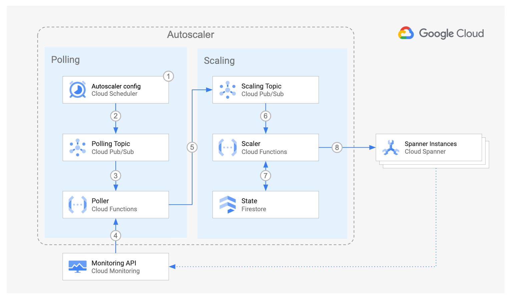

<br />
<p align="center">
  <h2 align="center">Autoscaler tool for Cloud Spanner</h2>
  

  <p align="center">
    <!-- In one sentence: what does the code in this directory do? -->
    Set up the Autoscaler in Cloud Run functions in a per-project
    deployment using Terraform
    <br />
    <a href="../../../README.md">Home</a>
    ·
    <a href="../../../src/scaler/README.md">Scaler component</a>
    ·
    <a href="../../../src/poller/README.md">Poller component</a>
    ·
    <a href="../../../src/forwarder/README.md">Forwarder component</a>
    ·
    Terraform configuration
    ·
    <a href="../README.md#Monitoring">Monitoring</a>
    <br />
    Cloud Run functions
    ·
    <a href="../../gke/README.md">Google Kubernetes Engine</a>
    <br />
    Per-Project
    ·
    <a href="../centralized/README.md">Centralized</a>
    ·
    <a href="../distributed/README.md">Distributed</a>

  </p>

</p>

## Table of Contents

*   [Table of Contents](#table-of-contents)
*   [Overview](#overview)
*   [Architecture](#architecture)
    *   [Pros](#pros)
    *   [Cons](#cons)
*   [Before you begin](#before-you-begin)
*   [Preparing the Autoscaler Project](#preparing-the-autoscaler-project)
*   [Deploying the Autoscaler](#deploying-the-autoscaler)
*   [Importing your Spanner instances](#importing-your-spanner-instances)
*   [Next steps](#next-steps)

## Overview

This directory contains Terraform configuration files to quickly set up the
infrastructure for your Autoscaler with a per-project deployment.

In this deployment option, all the components of the Autoscaler
reside in the same project as your Spanner instances.

This deployment is ideal for independent teams who want to self-manage the
infrastructure and configuration of their own Autoscalers. It is also a good
entry point for testing the Autoscaler capabilities.

## Architecture



For an explanation of the components of the Autoscaler and the
interaction flow, please read the
[main Architecture section](../README.md#architecture).

The per-project deployment has the following pros and cons:

### Pros

*   **Design**: this option has the simplest design.
*   **Configuration**: The control over scheduler parameters belongs to the team
    that owns the Spanner instance, therefore the team has the highest degree of
    freedom to adapt the Autoscaler to its needs.
*   **Infrastructure**: This design establishes a clear boundary of
    responsibility and security over the Autoscaler infrastructure because the
    team owner of the Spanner instances is also the owner of the Autoscaler
    infrastructure.

### Cons

*   **Maintenance**: with each team being responsible for the Autoscaler
    configuration and infrastructure it may become difficult to make sure that
    all Autoscalers across the company follow the same update guidelines.
*   **Audit**: because of the high level of control by each team, a centralized
    audit may become more complex.

## Before you begin

In this section you prepare your project for deployment.

1.  Open the [Cloud Console][cloud-console]
2.  Activate [Cloud Shell][cloud-shell] \
    At the bottom of the Cloud Console, a
    <a href='https://cloud.google.com/shell/docs/features'>Cloud Shell</a>
    session starts and displays a command-line prompt. Cloud Shell is a shell
    environment with the Cloud SDK already installed, including the
    <code>gcloud</code> command-line tool, and with values already set for your
    current project. It can take a few seconds for the session to initialize.

3.  In Cloud Shell, clone this repository

    ```sh
    git clone https://github.com/cloudspannerecosystem/autoscaler.git
    ```

4.  Export variables for the working directories

    ```sh
    export AUTOSCALER_DIR="$(pwd)/autoscaler/terraform/cloud-functions/per-project"
    ```

## Preparing the Autoscaler Project

In this section you prepare your project for deployment.

1.  Go to the [project selector page][project-selector] in the Cloud Console.
    Select or create a Cloud project.

2.  Make sure that billing is enabled for your Google Cloud project.
    [Learn how to confirm billing is enabled for your project][enable-billing].

3.  In Cloud Shell, set environment variables with the ID of your **autoscaler**
    project:

    ```sh
    export PROJECT_ID=<INSERT_YOUR_PROJECT_ID>
    gcloud config set project "${PROJECT_ID}"
    ```

4.  Choose the [region][region-and-zone] and
    [App Engine Location][app-engine-location] where the Autoscaler
    infrastructure will be located.

    ```sh
    export REGION=us-central1
    export APP_ENGINE_LOCATION=us-central
    ```

5.  Enable the required Cloud APIs

    ```sh
    gcloud services enable \
      appengine.googleapis.com \
      cloudbuild.googleapis.com \
      cloudfunctions.googleapis.com \
      cloudresourcemanager.googleapis.com \
      cloudscheduler.googleapis.com \
      compute.googleapis.com \
      eventarc.googleapis.com \
      firestore.googleapis.com \
      iam.googleapis.com \
      logging.googleapis.com \
      monitoring.googleapis.com \
      pubsub.googleapis.com \
      run.googleapis.com \
      spanner.googleapis.com
    ```

6.  Create a Google App Engine app, to enable the APIs
    for Cloud Scheduler and Firestore

    ```sh
    gcloud app create --region="${APP_ENGINE_LOCATION}"
    ```

7.  The Autoscaler state can be stored in either Firestore or Cloud Spanner.

    In case you want to use Firestore, update the database created with the
    Google App Engine app to use [Firestore native mode][firestore-native].

    ```sh
    gcloud firestore databases update --type=firestore-native
    ```

    In case you want to use Cloud Spanner, no action is needed at this point.

## Deploying the Autoscaler

1.  Set the project ID and region in the corresponding Terraform
    environment variables

    ```sh
    export TF_VAR_project_id="${PROJECT_ID}"
    export TF_VAR_region="${REGION}"
    ```

2.  If you want to create a new Spanner instance for testing the Autoscaler, set
    the following variable. The spanner instance that Terraform creates is named
    `autoscale-test`.

    ```sh
    export TF_VAR_terraform_spanner_test=true
    ```

    On the other hand, if you do not want to create a new Spanner instance
    because you already have an instance for the Autoscaler to monitor, set the
    name name of your instance in the following variable

    ```sh
    export TF_VAR_spanner_name=<INSERT_YOUR_SPANNER_INSTANCE_NAME>
    ```

    For more information on how to make your Spanner instance to be managed by
    Terraform, see [Importing your Spanner instances](#importing-your-spanner-instances)

3.  If you chose to store the state in Firestore, skip this step. If you want
    to store the state in Cloud Spanner and you don't have a Spanner
    instance yet for that, then set the following variable so that Terraform
    creates an instance for you named `autoscale-test-state`:

    ```sh
    export TF_VAR_terraform_spanner_state=true
    ```

    It is a best practice not to store the Autoscaler state in the same
    instance that is being monitored by the Autoscaler.

    Optionally, you can change the name of the instance that Terraform
    will create:

    ```sh
    export TF_VAR_spanner_state_name=<INSERT_STATE_SPANNER_INSTANCE_NAME>
    ```

    If you already have a Spanner instance where state must be stored,
    only set the the name of your instance:

    ```sh
    export TF_VAR_spanner_state_name=<INSERT_YOUR_STATE_SPANNER_INSTANCE_NAME>
    ```

    In your own instance, make sure you create the the database
    `spanner-autoscaler-state` with the following table:

    ```sql
    CREATE TABLE spannerAutoscaler (
      id STRING(MAX),
      lastScalingTimestamp TIMESTAMP,
      createdOn TIMESTAMP,
      updatedOn TIMESTAMP,
      lastScalingCompleteTimestamp TIMESTAMP,
      scalingOperationId STRING(MAX),
      scalingRequestedSize INT64,
      scalingMethod STRING(MAX),
      scalingPreviousSize INT64,
    ) PRIMARY KEY (id)
    ```

    Note: If you are upgrading from v1.x, then you need to add the 5 new columns
    to the spanner schema using the following DDL statements

    ```sql
    ALTER TABLE spannerAutoscaler ADD COLUMN IF NOT EXISTS lastScalingCompleteTimestamp TIMESTAMP;
    ALTER TABLE spannerAutoscaler ADD COLUMN IF NOT EXISTS scalingOperationId STRING(MAX);
    ALTER TABLE spannerAutoscaler ADD COLUMN IF NOT EXISTS scalingRequestedSize INT64;
    ALTER TABLE spannerAutoscaler ADD COLUMN IF NOT EXISTS scalingMethod STRING(MAX);
    ALTER TABLE spannerAutoscaler ADD COLUMN IF NOT EXISTS scalingPreviousSize INT64;
    ```

    Note: If you are upgrading from V2.0.x, then you need to add the 3 new columns
    to the spanner schema using the following DDL statements

    ```sql
    ALTER TABLE spannerAutoscaler ADD COLUMN IF NOT EXISTS scalingRequestedSize INT64;
    ALTER TABLE spannerAutoscaler ADD COLUMN IF NOT EXISTS scalingMethod STRING(MAX);
    ALTER TABLE spannerAutoscaler ADD COLUMN IF NOT EXISTS scalingPreviousSize INT64;
    ```

    For more information on how to make your existing Spanner instance to be
    managed by Terraform, see [Importing your Spanner instances](../per-project/README.md#importing-your-spanner-instances)

4.  Change directory into the Terraform per-project directory and initialize it.

    ```sh
    cd "${AUTOSCALER_DIR}"
    terraform init
    ```

5.  Import the existing AppEngine application into Terraform state

    ```sh
    terraform import module.scheduler.google_app_engine_application.app "${PROJECT_ID}"
    ```

6.  Create the Autoscaler infrastructure. Answer `yes` when prompted, after
    reviewing the resources that Terraform intends to create.

    ```sh
    terraform apply -parallelism=2
    ```

    If you are running this command in Cloud Shell and encounter errors of the form
    "`Error: cannot assign requested address`", this is a
    [known issue][provider-issue] in the Terraform Google provider, please retry
    the command above and include the flag `-parallelism=1`.

## Importing your Spanner instances

If you have existing Spanner instances that you want to
[import to be managed by Terraform][terraform-import], follow the instructions
in this section.

1.  List your spanner instances

    ```sh
    gcloud spanner instances list --format="table(name)"
    ```

2.  Set the following variable with the instance name from the output of the
    above command that you want to import

    ```sh
    SPANNER_INSTANCE_NAME=<YOUR_SPANNER_INSTANCE_NAME>
    ```

3.  Create a Terraform config file with an empty
    [`google_spanner_instance`][terraform-spanner-instance] resource

    ```sh
    echo "resource \"google_spanner_instance\" \"${SPANNER_INSTANCE_NAME}\" {}" > "${SPANNER_INSTANCE_NAME}.tf"
    ```

4.  [Import][terraform-import-usage] the Spanner instance into the Terraform
    state.

    ```sh
    terraform import "google_spanner_instance.${SPANNER_INSTANCE_NAME}" "${SPANNER_INSTANCE_NAME}"
    ```

5.  After the import succeeds, update the Terraform config file for your
    instance with the actual instance attributes

    ```sh
    terraform state show -no-color "google_spanner_instance.${SPANNER_INSTANCE_NAME}" \
      | grep -vE "(id|num_nodes|state|timeouts).*(=|\{)" \
      > "${SPANNER_INSTANCE_NAME}.tf"
    ```

If you have additional Spanner instances to import, repeat this process.

Importing Spanner databases is also possible using the
[`google_spanner_database`][terraform-spanner-db] resource and following a
similar process.

## Next steps

Your Autoscaler infrastructure is ready, follow the instructions in the main
page to [configure your Autoscaler](../README.md#configuration).

<!-- LINKS: https://www.markdownguide.org/basic-syntax/#reference-style-links -->

[project-selector]: https://console.cloud.google.com/projectselector2/home/dashboard
[enable-billing]: https://cloud.google.com/billing/docs/how-to/modify-project
[cloud-console]: https://console.cloud.google.com
[cloud-shell]: https://console.cloud.google.com/?cloudshell=true
[region-and-zone]: https://cloud.google.com/compute/docs/regions-zones#locations
[app-engine-location]: https://cloud.google.com/appengine/docs/locations
[terraform-import]: https://www.terraform.io/docs/import/index.html
[terraform-import-usage]: https://www.terraform.io/docs/import/usage.html
[terraform-spanner-instance]: https://www.terraform.io/docs/providers/google/r/spanner_instance.html
[terraform-spanner-db]: https://www.terraform.io/docs/providers/google/r/spanner_database.html
[provider-issue]: https://github.com/hashicorp/terraform-provider-google/issues/6782
[firestore-native]: https://cloud.google.com/datastore/docs/firestore-or-datastore#in_native_mode
