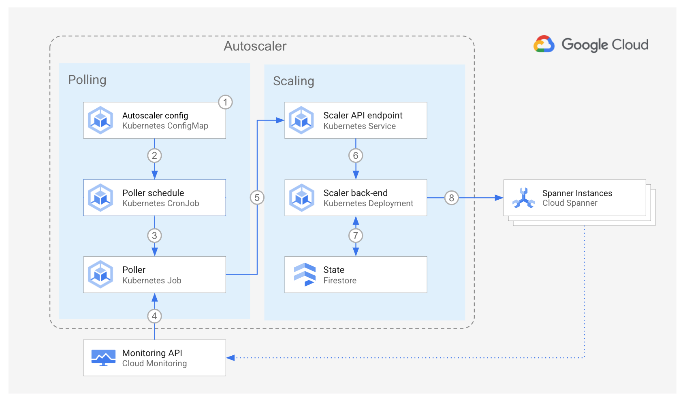

<br />
<p align="center">
  <h2 align="center">Autoscaler tool for Cloud Spanner</h2>
  

  <p align="center">
    <!-- In one sentence: what does the code in this directory do? -->
    Set up the Autoscaler using Terraform configuration files
    <br />
    <a href="../../README.md">Home</a>
    ·
    <a href="../../scaler/README.md">Scaler component</a>
    ·
    <a href="../../poller/README.md">Poller component</a>
    ·
    <a href="../../forwarder/README.md">Forwarder component</a>
    ·
    Terraform configuration
    ·
    <a href="../README.md#Monitoring">Monitoring</a>
    <br />
    <a href="../cloud-functions/README.md">Cloud Functions</a>
    ·
    Google Kubernetes Engine
  </p>

</p>

## Table of Contents

*   [Table of Contents](#table-of-contents)
*   [Overview](#overview)
*   [Architecture](#architecture)
    *   [Pros](#pros)
    *   [Cons](#cons)
*   [Before you begin](#before-you-begin)
*   [Preparing the Autoscaler Project](#preparing-the-autoscaler-project)
    *   [Using Firestore for Autoscaler state](#using-firestore-for-autoscaler-state)
    *   [Using Spanner for Autoscaler state](#using-spanner-for-autoscaler-state)
*   [Deploying the Autoscaler](#deploying-the-autoscaler)
*   [Importing your Spanner instances](#importing-your-spanner-instances)
*   [Building and Deploying the Autoscaler Services](#building-and-deploying-the-autoscaler-services)

## Overview

This directory contains Terraform configuration files to quickly set up the
infrastructure for your Autoscaler for a deployment to
[Google Kubernetes Engine (GKE)][gke].

In this deployment option, all the components of the Autoscaler reside in the
same project as your [Spanner][spanner] instances. A future enhancement may
enable the autoscaler to operate cross-project when running in GKE.

This deployment is ideal for independent teams who want to self-manage the
infrastructure and configuration of their own Autoscalers on Kubernetes.

## Architecture



1.  Using a [Kubernetes ConfigMap][kubernetes-configmap] you define which
    Spanner instances you would like to be managed by the autoscaler. Currently
    these must be in the same project as the cluster that runs the autoscaler.

2.  Using a [Kubernetes CronJob][kubernetes-cronjob], the autoscaler is
    configured to run on a schedule. By default this is every minute, though
    this is configurable.

3.  When scheduled, an instance of the [Poller][autoscaler-poller]
    is created as a [Kubernetes Job][kubernetes-job].

4.  The Poller queries the [Cloud Monitoring][cloud-monitoring] API to retrieve
    the utilization metrics for each Spanner instance.

5.  For each Spanner instance, the Poller makes a call to the Scaler via its
    API. The request payload contains the utilization metrics for the specific
    Spanner instance, and some of its corresponding configuration parameters.

6.  Using the chosen [scaling method](../../scaler/README.md#scaling-methods),
    the Scaler compares the Spanner instance metrics against the recommended
    thresholds, plus or minus an [allowed
    margin](../../poller/README.md#margins) and determines if the instance
    should be scaled, and the number of nodes or processing units that it
    should be scaled to.

7.  The Scaler retrieves the time when the instance was last scaled from the
    state data stored in [Cloud Firestore][cloud-firestore] (or alternatively
    [Spanner][spanner]) and compares it with the current time.

8.  If the configured cooldown period has passed, then the Scaler requests the
    Spanner Instance to scale out or in.

The GKE deployment has the following pros and cons:

### Pros

*   **Kubernetes-based**: For teams that may not be able to use Google Cloud
    services such as [Cloud Functions][cloud-functions], this design enables
    the use of the autoscaler.
*   **Configuration**: The control over scheduler parameters belongs to the team
    that owns the Spanner instance, therefore the team has the highest degree of
    freedom to adapt the Autoscaler to its needs.
*   **Infrastructure**: This design establishes a clear boundary of
    responsibility and security over the Autoscaler infrastructure because the
    team owner of the Spanner instances is also the owner of the Autoscaler
    infrastructure.

### Cons

*   **Infrastructure**: In contrast to the [Cloud Functions][cloud-functions]
    design, some long-lived infrastructure and services are required.
*   **Maintenance**: with each team being responsible for the Autoscaler
    configuration and infrastructure it may become difficult to make sure that
    all Autoscalers across the company follow the same update guidelines.
*   **Audit**: because of the high level of control by each team, a centralized
    audit may become more complex.

## Before you begin

In this section you prepare your environment.

1.  Open the [Cloud Console][cloud-console]
2.  Activate [Cloud Shell][cloud-shell] \
    At the bottom of the Cloud Console, a
    <a href='https://cloud.google.com/shell/docs/features'>Cloud Shell</a>
    session starts and displays a command-line prompt. Cloud Shell is a shell
    environment with the Cloud SDK already installed, including the
    <code>gcloud</code> command-line tool, and with values already set for your
    current project. It can take a few seconds for the session to initialize.

3.  In Cloud Shell, clone this repository:

    ```sh
    git clone https://github.com/cloudspannerecosystem/autoscaler.git
    ```

4.  Export variables for the working directories:

    ```sh
    export AUTOSCALER_ROOT="$(pwd)/autoscaler"
    export AUTOSCALER_DIR=${AUTOSCALER_ROOT}/terraform/gke
    ```

## Preparing the Autoscaler Project

In this section you prepare your project for deployment.

1.  Go to the [project selector page][project-selector] in the Cloud Console.
    Select or create a Cloud project.

2.  Make sure that billing is enabled for your Google Cloud project.
    [Learn how to confirm billing is enabled for your project][enable-billing].

3.  In Cloud Shell, configure the environment with the ID of your
    **autoscaler** project:

    ```sh
    export PROJECT_ID=<INSERT_YOUR_PROJECT_ID>
    gcloud config set project ${PROJECT_ID}
    ```

4.  Set the region where the Autoscaler resources will be created:

    ```sh
    export REGION=us-central1
    ```

5.  Enable the required Cloud APIs:

    ```sh
    gcloud services enable iam.googleapis.com \
      artifactregistry.googleapis.com \
      cloudbuild.googleapis.com \
      cloudresourcemanager.googleapis.com \
      container.googleapis.com \
      spanner.googleapis.com
    ```

6.  If you want to create a new Spanner instance for testing the Autoscaler, set
    the following variable. The Spanner instance that Terraform creates is named
    `autoscale-test`.

    ```sh
    export TF_VAR_terraform_spanner_test=true
    ```

    On the other hand, if you do not want to create a new Spanner instance
    because you already have an instance for the Autoscaler to monitor, set the
    name name of your instance in the following variable

    ```sh
    export TF_VAR_spanner_name=<INSERT_YOUR_SPANNER_INSTANCE_NAME>
    ```

    For more information on how to configure your Spanner instance to be
    managed by Terraform, see
    [Importing your Spanner instances](#importing-your-spanner-instances)

7.  There are two options for deploying the state store for the Autoscaler:

    1.  Store the state in [Firestore][cloud-firestore]
    2.  Store the state in [Spanner][spanner]

    For Firestore, follow the steps in
    [Using Firestore for Autoscaler State](#using-firestore-for-autoscaler-state).
    For Spanner, follow the steps in [Using Spanner for Autoscaler state](#using-spanner-for-autoscaler-state).

## Using Firestore for Autoscaler state

1.  To use Firestore for the Autoscaler state, choose the
    [App Engine Location][app-engine-location] where the Autoscaler
    infrastructure will be created, for example:

    ```sh
    export APP_ENGINE_LOCATION=us-central
    ```

2.  Enable the additional APIs:

    ```sh
    gcloud services enable \
      appengine.googleapis.com \
      firestore.googleapis.com
    ```

3.  Create a Google App Engine app to enable the API for Firestore:

    ```sh
    gcloud app create --region="${APP_ENGINE_LOCATION}"
    ```

4.  Create a database to store the state of the Autoscaler:

    ```sh
    gcloud firestore databases create --location="${APP_ENGINE_LOCATION}"
    ```

    You will also need to make a minor modification to the Autoscaler
    configuration. The required steps to do this are later in these
    instructions.

5.  Next, continue to [Deploying the Autoscaler](#deploying-the-autoscaler)

## Using Spanner for Autoscaler state

1.  If you want to store the state in Cloud Spanner and you don't have a Spanner
    instance yet for that, then set the following variable so that Terraform
    creates an instance for you named `autoscale-test-state`:

    ```sh
    export TF_VAR_terraform_spanner_state=true
    ```

    It is a best practice not to store the Autoscaler state in the same
    instance that is being monitored by the Autoscaler.

    Optionally, you can change the name of the instance that Terraform
    will create:

    ```sh
    export TF_VAR_state_spanner_name=<INSERT_STATE_SPANNER_INSTANCE_NAME>
    ```

    If you already have a Spanner instance where state must be stored,
    only set the the name of your instance:

    ```sh
    export TF_VAR_state_spanner_name=<INSERT_YOUR_STATE_SPANNER_INSTANCE_NAME>
    ```

    If you want to manage the state of the Autoscaler in your own
    Cloud Spanner instance, please create the following table in advance:

    ```sql
    CREATE TABLE spannerAutoscaler (
       id STRING(MAX),
       lastScalingTimestamp TIMESTAMP,
       createdOn TIMESTAMP,
       updatedOn TIMESTAMP,
    ) PRIMARY KEY (id)
    ```

2.  Next, continue to [Deploying the Autoscaler](#deploying-the-autoscaler)

## Deploying the Autoscaler

1.  Set the project ID and region in the corresponding Terraform
    environment variables:

    ```sh
    export TF_VAR_project_id=${PROJECT_ID}
    export TF_VAR_region=${REGION}
    ```

2.  Change directory into the Terraform per-project directory and initialize it:

    ```sh
    cd ${AUTOSCALER_DIR}
    terraform init
    ```

3.  Create the Autoscaler infrastructure:

    ```sh
    terraform plan -out=terraform.tfplan
    terraform apply -auto-approve terraform.tfplan
    ```

If you are running this command in Cloud Shell and encounter errors of the form
"`Error: cannot assign requested address`", this is a
[known issue][provider-issue] in the Terraform Google provider, please retry
with `-parallelism=1`.

Next, continue to [Building and Deploying the Autoscaler Services](#building-and-deploying-the-autoscaler-services).

## Importing your Spanner instances

If you have existing Spanner instances that you want to
[import to be managed by Terraform][terraform-import], follow the instructions
in this section.

1.  List your spanner instances

    ```sh
    gcloud spanner instances list
    ```

2.  Set the following variable with the instance name to import

    ```sh
    SPANNER_INSTANCE_NAME=<YOUR_SPANNER_INSTANCE_NAME>
    ```

3.  Create a Terraform config file with an empty
    [`google_spanner_instance`][terraform-spanner-instance] resource

    ```sh
    echo "resource \"google_spanner_instance\" \"${SPANNER_INSTANCE_NAME}\" {}" > "${SPANNER_INSTANCE_NAME}.tf"
    ```

4.  [Import][terraform-import-usage] the Spanner instance into the Terraform
    state.

    ```sh
    terraform import "google_spanner_instance.${SPANNER_INSTANCE_NAME}" "${SPANNER_INSTANCE_NAME}"
    ```

5.  After the import succeeds, update the Terraform config file for your
    instance with the actual instance attributes

    ```sh
    terraform state show -no-color "google_spanner_instance.${SPANNER_INSTANCE_NAME}" \
      | grep -vE "(id|num_nodes|state|timeouts).*(=|\{)" \
      > "${SPANNER_INSTANCE_NAME}.tf"
    ```

If you have additional Spanner instances to import, repeat this process.

Importing Spanner databases is also possible using the
[`google_spanner_database`][terraform-spanner-db] resource and following a
similar process.

## Building and Deploying the Autoscaler Services

1.  To build the Autoscaler images and push them to Artifact Registry, run the
    following commands:

    ```sh
    cd ${AUTOSCALER_ROOT} && \
    gcloud builds submit poller --config=poller/cloudbuild.yaml --region=${REGION} && \
    gcloud builds submit scaler --config=scaler/cloudbuild.yaml --region=${REGION}
    ```

2.  Construct the paths to the images:

    ```sh
    POLLER_PATH="${REGION}-docker.pkg.dev/${PROJECT_ID}/spanner-autoscaler/poller"
    SCALER_PATH="${REGION}-docker.pkg.dev/${PROJECT_ID}/spanner-autoscaler/scaler"
    ```

3.  Retrieve the SHA256 hashes of the images:

    ```sh
    POLLER_SHA=$(gcloud artifacts docker images describe ${POLLER_PATH}:latest --format='value(image_summary.digest)')
    SCALER_SHA=$(gcloud artifacts docker images describe ${SCALER_PATH}:latest --format='value(image_summary.digest)')
    ```

4.  Construct the full paths to the images, including the SHA256 hashes:

    ```sh
    POLLER_IMAGE="${POLLER_PATH}@${POLLER_SHA}"
    SCALER_IMAGE="${SCALER_PATH}@${SCALER_SHA}"
    ```

5.  Retrieve the credentials for the cluster where the Autoscaler will be deployed:

    ```sh
    gcloud container clusters get-credentials spanner-autoscaler --region=${REGION}
    ```

6.  Next, to configure the Kubernetes manifests and deploy the Autoscaler to
    the cluster, run the following commands:

    ```sh
    cd ${AUTOSCALER_ROOT}/kubernetes && \
    kpt fn eval --image gcr.io/kpt-fn/apply-setters:v0.1.1 autoscaler-pkg -- poller_image=${POLLER_IMAGE} scaler_image=${SCALER_IMAGE} && \
    kubectl apply -f autoscaler-pkg/ --recursive
    ```

    The sample configuration creates two schedules to demonstrate autoscaling;
    a [frequently running schedule][cron-frequent] to dynamically scale the
    Spanner instance according to utilization, and an [hourly
    schedule][cron-hourly] to directly scale the Spanner instance every hour.

7.  To prepare to configure the Autoscaler, run the following command:

    ```sh
    for template in $(ls autoscaler-config/*.template) ; do envsubst < ${template} > ${template%.*} ; done
    ```

8.  Next, to see how the Autoscaler is configured, run the following command to
    output the example configuration:

    ```sh
    cat autoscaler-config/autoscaler-config*.yaml
    ```

    These two files configure each instance of the autoscaler that you
    scheduled in the previous step. Notice the environment variable
    `AUTOSCALER_CONFIG`. You can use this variable to reference a configuration
    that will be used by that individual instance of the autoscaler. This means
    that you can configure multiple scaling schedules across multiple Spanner
    instances.

    If you do not supply this value, a default of `autoscaler-config.yaml` will
    be used.

    You can autoscale multiple Spanner instances on a single schedule by
    including multiple YAML stanzas in any of the scheduled configurations. For
    the schema of the configuration, see the [Poller configuration]
    autoscaler-config-params] section.

9.  If you have chosen to use Firestore to hold the Autoscaler state as described
    above, edit the above files, and remove the following lines:

    ```yaml
     stateDatabase:
       name: spanner
       instanceId: autoscale-test
       databaseId: spanner-autoscaler-state
    ```

    **Note:** If you do not remove these lines, the Autoscaler will attempt to
    use the above non-existent Spanner database for its state store, which will
    result in the Poller component failing to start. Please see the
    [Troubleshooting](#troubleshooting) section for more details.

    If you have chosen to use your own Spanner instance, please edit the above
    configuration files accordingly.

10.  To configure the Autoscaler and begin scaling operations, run the following
     command:

     ```sh
     kubectl apply -f autoscaler-config/
     ```

11.  Any changes made to the configuration files and applied with `kubectl
     apply` will update the Autoscaler configuration.

12.  You can view logs for the Autoscaler components via `kubectl` or the [Cloud
     Logging][cloud-console-logging] interface in the Google Cloud console.

## Troubleshooting

This section contains guidance on what to do if you encounter issues when
following the instructions above.

### If the GKE cluster is not successfully created

1.  Check there are no [Organizational Policy][organizational-policy] rules
    that may conflict with cluster creation.

### If you do not see scaling operations as expected

1.  The first step if you are encountering scaling issues is to check the logs
    for the Autoscaler in [Cloud Logging][cloud-console-logging]. To retrieve
    the logs for the `Poller` and `Scaler` components, use the following query:

    ```terminal
    resource.type="k8s_container"
    resource.labels.namespace_name="spanner-autoscaler"
    resource.labels.container_name="poller" OR resource.labels.container_name="scaler"
    ```

    If you do not see any log entries, check that you have selected the correct
    time period to display in the Cloud Logging console, and that the GKE
    cluster nodes have the correct permissions to write logs to the Cloud
    Logging API ([roles/logging.logWriter][logging-iam-role]).

### If the Poller fails to run successfully

1.  If you have chosen to use Firestore for Autoscaler state and you see the
    following error in the logs:

    ```sh
     Error: 5 NOT_FOUND: Database not found: projects/<YOUR_PROJECT>/instances/autoscale-test/databases/spanner-autoscaler-state
    ```

    Edit the file `${AUTOSCALER_ROOT}/autoscaler-config/autoscaler-config.yaml`
    and remove the following stanza:

    ```yaml
     stateDatabase:
       name: spanner
       instanceId: autoscale-test
       databaseId: spanner-autoscaler-state
    ```

2.  Check the formatting of the YAML configration file:

    ```sh
    cat ${AUTOSCALER_ROOT}/autoscaler-config/autoscaler-config.yaml
    ```

<!-- LINKS: https://www.markdownguide.org/basic-syntax/#reference-style-links -->
[autoscaler-poller]: ../../poller/README.md
[autoscaler-config-params]: ../../poller/#configuration-parameters
[cron-frequent]: ../../kubernetes/autoscaler-pkg/poller/poller.yaml
[cron-hourly]: ../../kubernetes/autoscaler-pkg/poller/poller-hourly.yaml

<!-- GKE deployment architecture -->
[gke]: https://cloud.google.com/kubernetes-engine
[kubernetes-configmap]: https://kubernetes.io/docs/concepts/configuration/configmap/
[kubernetes-cronjob]: https://kubernetes.io/docs/concepts/workloads/controllers/cron-jobs/
[kubernetes-job]: https://kubernetes.io/docs/concepts/workloads/controllers/job/
[logging-iam-role]: https://cloud.google.com/logging/docs/access-control#logging.logWriter
[spanner]: https://cloud.google.com/spanner/
[cloud-monitoring]: https://cloud.google.com/monitoring
[cloud-firestore]: https://cloud.google.com/firestore
[cloud-functions]: https://cloud.google.com/functions

<!-- General -->
[project-selector]: https://console.cloud.google.com/projectselector2/home/dashboard
[enable-billing]: https://cloud.google.com/billing/docs/how-to/modify-project
[cloud-console]: https://console.cloud.google.com
[cloud-console-logging]: https://console.cloud.google.com/logs/query
[cloud-shell]: https://console.cloud.google.com/?cloudshell=true
[app-engine-location]: https://cloud.google.com/appengine/docs/locations
[terraform-import]: https://www.terraform.io/docs/import/index.html
[terraform-import-usage]: https://www.terraform.io/docs/import/usage.html
[terraform-spanner-instance]: https://www.terraform.io/docs/providers/google/r/spanner_instance.html
[terraform-spanner-db]: https://www.terraform.io/docs/providers/google/r/spanner_database.html
[provider-issue]: https://github.com/hashicorp/terraform-provider-google/issues/6782
[organizational-policy]: https://cloud.google.com/resource-manager/docs/organization-policy/overview
